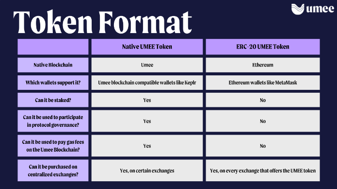

# Mars Protocol

<figure><figcaption></figcaption></figure>

Видение Mars строится на С2С (contract-2-contract) кредитовании, которые позволяет смарт-контрактам, интегрированными с Mars, заимствовать активы из Red Bank для заранее установленной цели. Это позволит использовать больше средств и использовать их более эффективно. Например, C2C будет развернут на Osmosis, что позволит пользователям взять займ OSMO для фарминга LP на Osmosis с кредитным плечом т.е. увеличить свою позицию OSMO для получения большого эффекта.

Red Bank - это место, через которые происходят все взаимодействия пользователя с Mars Hub. Именно тут мы вносим депозит, берем займ, а так же выбираем C2C стратегию.

В Mars так же есть такое понятие, как Rover-счет. Это единый счёт, который отражает общую обеспеченность всех открытых пользователем позиций и всех используемых стратегий. Сделаны Rover-счета для оптимизации работы с заемщиком, решения проблемы с обеспечением кросс-маржинальных С2С стратегий, а так же для удобства управления своими позициями.

Эта архитектура дает пользователям возможность кросс-обеспечения различных стратегий с кредитным плечом в одной учетной записи с одним LTV (ликвидационная стоимость кредита). Важно отметить, что помимо общего обеспечения между стратегиями C2C, Rover-счета также могут интегрироваться с другими DeFi. Это позволяет пользователям выполнять взаимодействие с любым dApp, интегрированными в Mars Protocol, с одним LTV на уровне учетной записи. Rover-счета будут представлены как NFT, а кошелек может содержать несколько отдельных Rover-счетов, подобно субсчетам на CEX. Rover-счета создают «объединенный» опыт DeFi, поскольку пользователи смогут получить доступ к своим любимым токенам, фармилкам и иным протоколам, используя кредитное плечо на Mars.

Так как Rover - счета это NFT, они выполняют следующие функции:

\- Идентичность: кредитные счета могут раскрывать собственный капитал в сети, фактор здоровья и прибыли/убытки, что дает им возможность внести свой вклад в идентичность в сети и позволяет использовать социальные функции, такие как списки лидеров, «наблюдение за китами», копи-трейдинг и т. д.

\- Передача/продажа: пользователи могут продать или передать свой кредитный счет другому пользователю, включая все позиции в нем.

\- Фракционализация: пользователи могут дробить свой кредитный счет на взаимозаменяемые части и продавать или распространять их. При условии наличия соответствующих средств управления это может позволить другим пользователям фактически владеть долей торговой деятельности данного пользователя, и для этих дробных частей кредита может быть создан вторичный рынок.

\-Поведение и компетентность в сети: можно отслеживать для оценки кредитоспособности.

Команда решила запустить собственный appchain так как в Cosmos есть проблема с разрозненностью ликвидности. Mars Protocol планирует итегрироваться со всеми сетями, где есть ликвидность, используя для этого собственный Mars Hub.

<figure><figcaption>
Архитектура Mars Hub. В настоящий момент запущен только OUTPOST 1 (Osmosis), где идёт постепенное введение и обкатывание всех фишек Mars.
</figcaption></figure>

<figure><figcaption>
Архитектура OUTPOST
</figcaption></figure>

Важно отметить, что Mars Hub не хранит ликвидность для OUTPOST, лишь управляет деятельностью, которая происходит на OUTPOST. Т.е. если вы хотите воспользоваться Osmosis OUTPOST, вам не нужно вносить деньги в сеть Mars. Mars Hub управляет всеми смарт-контрактами OUTPOST, получает комиссионные от OUTPOST и распределяет их между участниками управления Mars. Можно провести аналогию, что Mars Hub работает, как франчайзинговая компания: устанавливает стандарты, но оставляет взаимодействие с клиентами на усмотрение отдельных подразделений(в нашем случае сетей). Точно так же трейдеры и другие участники рынка, которые не заинтересованы в управлении , вряд ли будут взаимодействовать с Mars Hub. Вместо этого Hub служит координационным механизмом в фоновом режиме, в то время как пользователи напрямую взаимодействуют с ликвидностью, агрегированной на каждом из MARS OUTPOST.

Давайте резюмируем, как работает Mars Protocol для пользователя:

<figure><figcaption></figcaption></figure>

Пользователи Mars Protocol делятся на следующие типы:

\- Валидаторы/Стейкеры: защищают сеть Mars Hub, управляют OUTPOST, внедряют новые функции и устанавливайте параметры риска Red Bank. В обмен на это они получают часть доходов от протокола.

\- Кредиторы: вносят активы в пулы ликвидности Mars, получая комиссию, аналогичную процентной ставке.

\- Заемщики (обеспеченные залогом): занимают активы из пулов ликвидности Mars, используя свои депонированные активы в качестве залога. Таким образом, эти заемщики также являются вкладчиками.

\- Заемщики (на основе контрактов): смарт-контракты, интегрированные для заимствования активов из пулов ликвидности Mars без предоставления обеспечения (поскольку сами контракты будут содержать обеспечение). Каждый смарт-контракт должен быть одобрен руководством с установленным кредитным лимитом для снижения риска, связанного с протоколом. Эти кредитные линии поддерживают кредитные счета Mars, предоставляя конечным пользователям доступ к кредитному плечу без предварительного требования депозитов Red Bank.

\- Ликвидаторы: Третьи стороны, которые ликвидируют позиции Red Bank, погашая долг пользователей с недостаточным обеспечением в обмен на комиссию.\
Механизм ликвидации в Red Bank классический.

### **Токеномика** 

Главным утилити MARS является управление и защита сети.

Все доходы Red Bank распределяются следующим образом:

80% платежей по процентам за кредиты поступают пользователям, предоставляющим ликвидность.

10% процентов обмениваются на axlUSDC, затем обмениваются на MARS и отправляются стейкерам в качестве награды.

Оставшиеся 10% конвертируются в axlUSDC и отправляются в Safety Fund. Средства из фонда будут использоваться для устранения дефицита внутри пула, а так же в случае того или иного форс-мажора.

<figure><figcaption></figcaption></figure>

К Mars Contributors относятся и инвесторы и команда. Эти 30% начнут выходить в рынок лишь в сентябре этого года, а сам разлок продлиться 3 года. Token Claim это дроп для пользователей Mars с Terra, всё уже в рынке. Community Pool - инцентивайзы, награды валидаторам, пользователям и т.д.

### Дорожная карта 

<figure><figcaption></figcaption></figure>

На 8 февраля 2023 года был запущен первый OUTPOST на Osmosis и идёт подготовка к запуску C2C.

### Вывод 

Osmosis главный хаб ликвидности на Cosmos. А Mars первый протокол, что будет интегрирован в Osmosis. Проблем с ликвидностью быть не должно. Далее пойдут интеграции с другими проектами на Cosmos. И это потрясающе, ликвидность в экосистеме наконец перестанет вращаться в паре точек, а будет разбредаться по множеству мест. Но стоит помнить, что всё это займет не мало времени, не один и даже не 6 месяцев. Но как говорится, Sic Parvis Magna

### Ссылки 

[https://osmosis.marsprotocol.io/redbank](https://osmosis.marsprotocol.io/redbank)

[https://github.com/mars-protocol/whitepaper](https://github.com/mars-protocol/whitepaper)

[https://twitter.com/mars\_protocol](https://twitter.com/mars\_protocol)
