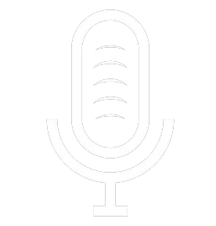

# Citizen Cosmos

 (2).png>)

### **Моникер:** Citizen Cosmos

### **Перечень валидируемых сетей:**

[Cosmos Hub](../../cosmobook/cosmoshub.md), [Evmos](../../cosmobook/evmos.md), Bostrom, Neutron, Celestia RPC provider

### **Краткий рассказ о себе:**

Citizen Cosmos - разработчик экосистемы во вселенной web3. Проще говоря, это означает, что мы в некотором роде являемся городским управляющим, работающим напрямую - для города и его жителей, читай - держателей токенов. Это противоположно работе с третьей стороной, то есть с кем-то, кто представляет голос народа, например, с мэром. Загвоздка в том, что наши города - это децентрализованные, свободные от цензуры, открытые и верифицируемые сети блокчейн. Таким образом, мы не являемся мэром или третьей стороной, мы являемся частью голоса сообщества.

Мы считаем, что блокчейн следует рассматривать как цифровую нацию, и, используя инструменты, которыми мы владеем, мы помогаем создать и принести ценность этим нациям. Наши инструменты различны, но на данный момент включают в себя подкаст, ориентированный на web3, стримы, социальные сети, образовательный контент, хакатоны, инфраструктуру распределенных валидаторов и нашу офлайн-сеть, которая позволяет нам помогать командам разработчиков создавать стратегические партнерства, особенно на ранних стадиях.

Мы также начинаем работать с оффлайн-проектами, такими как местные художники, галереи, пермакультурные сообщества и т.д. Помогаем им в просвещении о криптовалютах, а иногда и инвестируем в них, жертвуя криптовалюту.

Что нам это дает? Мы монетизируем себя через наши валидаторы. Если мы считаем, что город может быть процветающим и он соответствует нашим ценностям, мы начинаем работать вокруг него. В свою очередь, жители города, читай - пользователи блокчейна, передают токены нашим валидаторам, что помогает нам продолжать работу.

На данный момент Citizen Cosmos в первую очередь ориентирован на Tendermint, Cosmos-SDK и Ethereum, но не только. Наш подкаст посвящен интерчейну, и мы проверяем сети на базе Cosmos. Мы освещаем события как СМИ, организуем и спонсируем мероприятия, создаем образовательный контент и помогаем людям погрузиться в кроличью нору.

Наши цели гораздо шире. Мы стремимся и строим, чтобы стать layer-0, то есть мостом между экосистемой и сообществом.

### **Участие в жизни экосистемы (продукты):**

Подкасты, стримы, дебаты, руководства, игры, инфраструктура, партнерство

<table><thead><tr><th>Ссылки:</th><th data-hidden></th><th data-hidden></th></tr></thead><tbody><tr><td>
 <a href="https://www.citizencosmos.space/staking">https://www.citizencosmos.space/staking</a> 

 <a href="https://discord.com/invite/XY67YBjK7k">https://discord.com/invite/XY67YBjK7k</a> 

 <a href="https://twitter.com/cosmos_voice">https://twitter.com/cosmos_voice</a> 

 <a href="https://citizen-cosmos.github.io/manuscripts/">https://citizen-cosmos.github.io/manuscripts/</a> 

 <a href="https://t.me/citizen_cosmos">https://t.me/citizen_cosmos</a> 

 <a href="https://github.com/citizen-cosmos">https://github.com/citizen-cosmos</a>
</td><td></td><td></td></tr></tbody></table>

