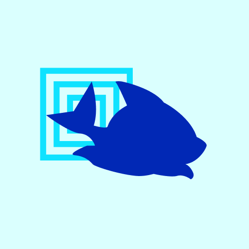

# Stakewolle

<figure><figcaption></figcaption></figure>

### **Моникер: Stakewolle**

### **Перечень валидируемых сетей:**

[Cosmos Hub](../../cosmobook/cosmoshub.md), [Juno](../../cosmobook/juno/), [Osmosis](../../cosmobook/osmosis.md), [Stargaze](../../cosmobook/stargaze.md), [Evmos](../../cosmobook/evmos.md), [Gravity Bridge](../../cosmobook/gravity-bridge.md), Crescent, Desmos, [Secret](../../cosmobook/secret-network.md), Rebus, [Stride](../../readme/stride.md), [E-money](../../cosmobook/e-money.md), Jackal, [Sentinel](../../cosmobook/sentinel.md), Bitsong, [Nomic](../../cosmobook/nomic.md), Decentr, [UMEE](../../readme/umee.md)

### **Краткий рассказ о себе:**

Валидатор с 2020 года, поддерживаем более 45 сетей. Наши ноды имеют 99.9 аптайм, а стекйинг застрахован от слешинга. Запустили Stakewolle Platform, которая позволяет зарабататывать больше, выполняя простые задания.

### **Участие в жизни экосистемы (продукты):**

Участвуем в подкастах Cosmos Ecosystem, активно ведем социальные сети, разрабатываем решения для Injective, Persistance.

<table><thead><tr><th>Ссылки:</th><th data-hidden></th><th data-hidden></th></tr></thead><tbody><tr><td> <a href="https://stakewolle.com/">https://stakewolle.com/</a>  <a href="https://twitter.com/stakewolle">https://twitter.com/stakewolle</a></td><td></td><td></td></tr></tbody></table>
